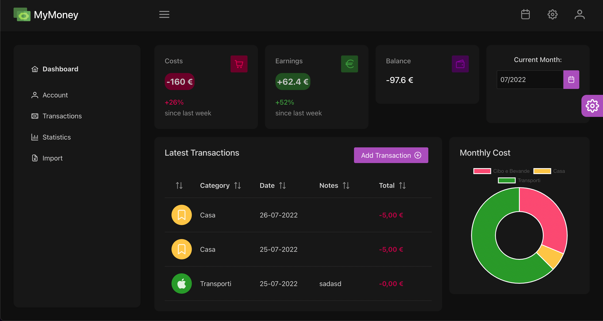
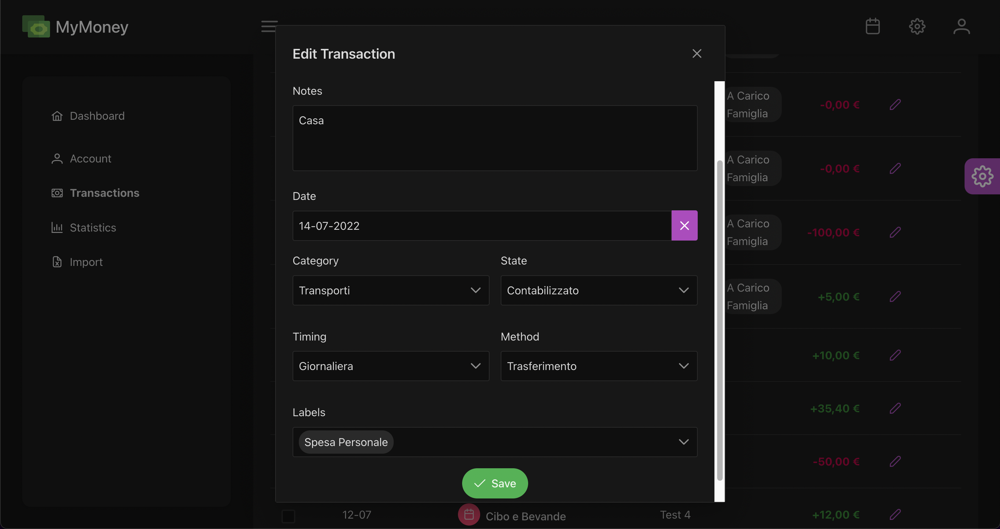

## About MyMoney

MyMoney is a Free and Open Source solution for asset management, tracking spending, to stay in control and achieve your future economic goals. 
We aspiring to cover all aspect of Asset Management in every field.


<a href="#"></a>
<a href="#"></a>


## Built with
- [Laravel](https://laravel.com).
- [Eloquent](https://laravel.com/docs/eloquent).
- [Laravel Mix](https://laravel-mix.com/).
- [Vue.js](https://vuejs.org/).
- [PrimeVUE](https://www.primefaces.org/primevue/#/).
- [Chart.js](https://www.chartjs.org/).
- [Docker](https://www.docker.com/).

 
## Getting Started
- Setting up repository
	```bash
	git clone https://github.com/alexcalabrese/MyMoney.git
	cd MyMoney
	composer update
	```
- Copy .env.example file and rename it to .env
- Running Server's setup
	```bash
	alias sail='[ -f sail ] && bash sail || bash vendor/bin/sail'
	sail up
	sail build --no-cache
	sail npm install
	sail npm run dev
	sail artisan key:generate
	```
	```bash
	sail artisan migrate
	sail artisan db:seed
	sail artisan storage:link
	```

## New Features

We want to add various Assets:
 - Crypto: Portfolio Tracking on CeFi and DeFi, Sync with major exchanges.
 - Real Estate: Assessment Tracking based on Location and more parameters.
 - Stocks.

## Contributing

Thank you for considering contributing to MyMoney! ❤
